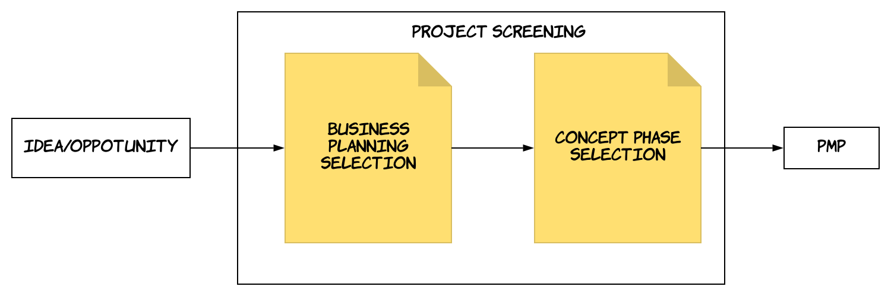
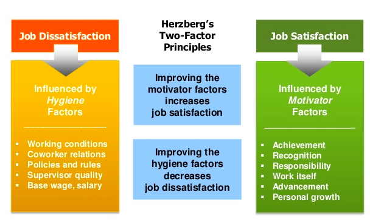
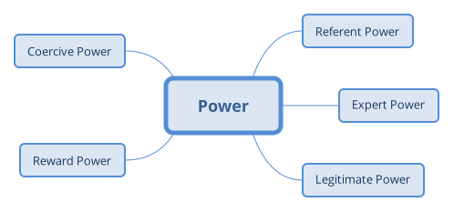
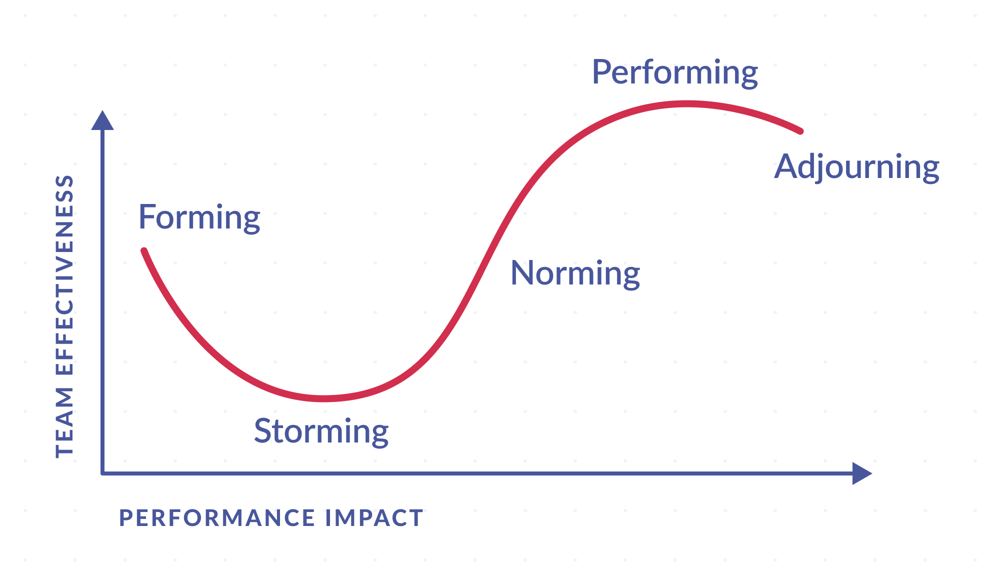
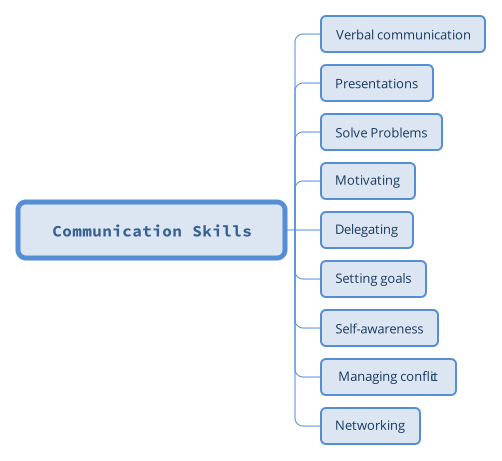
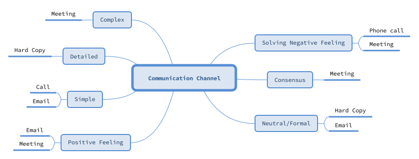
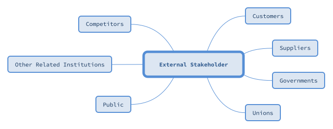
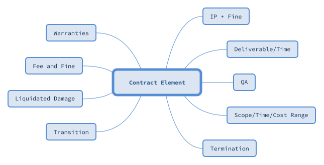
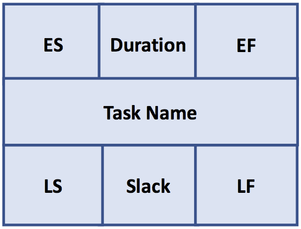
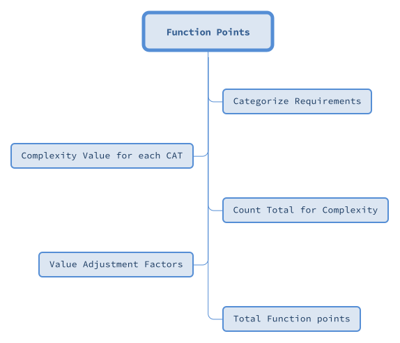

- [Basic about project](#project)
- [Basic about PM](#project-management-overall)
- [Initiation](#project-initiation)
- [PMP](#project-management-planning)
- [Team](#people-skills-team)
- [Communication and Stakeholders](#people-skills-communication-and-stakeholders)
- [Ethics](#ethics)
- [Outsourcing](#outsourcing)
- [Project Scheduling](#project-scheduling)
- [Cost Estimation](#cost-estimation)
- [Risk Management](#risk-management)
- [Quality Management](#quality-management)
- [Configuration Management](#configuration-management)

## Project

### What is a project

A temporary endeavor to create a unique product, service, or outcome. It should introduce **changes to org**, have a **start to end**, being **cross-functional**, **unique**, and **not free(anymeans)**.

### Why use a project

1. Strategic alignment of key activities and visibility at appropriate level.

2. Priorities activities.

3. Deliver change in a structured and organized manner.

4. Effective and efficient management of organization's limited resources.

5. Establish ownership and accountability.

6. Provides clarity across what will be done, when, who, why, and the outcome.

## Project Management Overall

### What is project management

Planning, delegating, monitoring, and controlling of all aspects of a project; and motivating **those** involved in the project to achieve objective within limited **time, cost, quality, scope, benefits, and risks**.

> Working on project, manipulating people, to achieve objectives, using limited resources.

Its valuable because:

- Resource is limited

- Risk needs to be managed

- Issues persists

- Changes need to be made

- Knowledge needs to be obtained

- Experience should be obtained

### Project Manager

Key features:

> Strong knowledge worker who knows how to manipulate people, inspire them, and targeted on achieving project objectives.

What project manager do:

> Project manager needs to **Plan** -> **Organize** -> **Lead** -> **Control** the project from start to end.

### Scrum Master

**Command & Control** -> **Servant Leadership**

> Works is distributed to team members who deems fit the job. Scrum master doesn't have to be all power, but know when to give permission.

### Project Managing Process and SDLCs

> PRINCE2 & PMBOK are PMP; Agile and Formal are set of SDLCs.

| PRINCE2 | PMBOK |
| :-: | :-: |
| Gov Backed | Useful standard |
| Widely used & accepted - Consulting, Private, Gov | Plan future in details |
| Process oriented | Substantial & detailed framework |
| Project -> Stages | Rigorous Control |
| Detailed & Thorough | Clearly defined roles |
| Clear need, target customer, realistic benefit, thorough analysis |  Clear and validated deliverables |

> PRINCE2 is overall better (No args accepted). 

PRINCE2 has extensive documentation which is helpful with corporate planning and tracking.

PMBOK has extensive tools, techniques, and supporting template to manage, monitor, and control.

---

| Agile | Formal |
| :-: | :-: |
| Adaptive | Little ALT |
| Constant FB | Req defined at first |
| CI/CD | Sequentially complete task |
| Involvement & Ownership across whole team | PM is the boss |
| Team self select jobs | PM assigned jobs |
| Small actions (Sprint/Scrum/Tasks) | Used in Large SW |
| Customer focus and interactive | Traditional > 40Ys |

> Agile is more flexible, fits CI/CD, increase PRJ success rate of 6%.

Formal methods has extensive planning, accurate timeline & budget. (Better estimation) Difficult on **roll back**

Agile is flexible, better engaged, but difficult without SM, hard to apply on large PRJ.

### How to success

60% chances by looking at: **executive sponsorship** (positive related to PM effort), **emotional maturity** (are people experienced),  **User Involvement** (Agile related), **Optimization** (Requirement states).

Outsource to professionals; using mature architecture; using agile; PM is good; ... (Honestly, the rest is redudant)

## Project Initiation

### Project Screening

Idea to project:

### Business Case

**Case study**(Bz needs) -> **Contraint Study**(Scope, time, cost) -> **Develop Business Case** -> **Project Charter**(Simple display)

> For bosses to know if the project worth taking; how it adds value to the org; matching predefined org characteristics; focus on benefit/investment; document throughout the project.

---

> Non-mandatory (non-volunteering) projects need to make money primarily.

**Return On Investment** : (TD Benefit - TD Cost) / TD Cost \* Total Discounted: a ratio, by AU gov, 4%-10%, avg. 7%.

**Net Present Value** : Net Monetary gain/loss over all future discounted cost and benefit (No idea what it is).

**Payback Period** : How long before benefit > cost, and payback recover initial cost.

**Rough Order of Magnitude** : Estimation increase by time, initially 25% margin plus minus (Cone of Uncertainty).

## Project Management Planning

Project Management Planning is composed by **Project Management Plan** and **SDLC**.

### What is Project Management & SDLC

Project management is a process which defines a series of tasks (**Planning** -> **Executing** -> **Controlling**) to deliver an outcome.

SDLC (**Systems** Development Life Cycle) is a process of **Planning** -> **Creating** -> **Testing** -> **Deploying** an Info System.

> A process is a series of progressive and interdependent steps by which an end is attained.

### Project Management Plan

> No unified standard of PMP must be followed, the standard varies but the goal shared.

PMP is a formal document on how the project should be **executed** -> **monitored** -> **controlled**, fully managed by *Project Manager*, providing details and holding truth.

> PC is short/summarized, PMP is formal and detailed. (PC shows why to do a project/PMP shows how)

---

Additionally, PMP should contains:

- Roles/Responsibilities

- Mandatory Project Planning:
	- Schedule
	- Risk Management
	- Cost Estimation
	- QA
	- CM

PMP is **large**, multiple *expert* would coporate on prepraing details, *PM* coordinates, in charge, and take the accountability for **quality** and **outcome**.

### SDLC

SDLC would be selected in **Project Planning** but execute in **Execution Phase**.

> The process of **implementation** -> **integration** -> **testing** -> **deployment** often in cycles, considered as CI/CD.

---

#### Formal Methods

Waterfall:

- simple to apply

- easy to manage

- phases are processed sequentially

- documentation is rich

- for requirements are very well understood and stable

BUT:

- not adaptive to changes (Incremental is better)

- sequentially processed phase tasks

- requirements must be clear

- client approval at the very end

- difficult to integrate risk management

---

Incremental is **multi-waterfall**, it can **early/fast release** operational product, **adaptive** to changes, **FB** is enabled to client for each build, and **easier for testing**; however, it requires **more resources**, **management attention**, increments are hard to **partition**, phases are still sequential, **integration issue**.

---

V-model is **continuous-testing-waterfall**, easy to use, has clear **phase objectives**, early testing increase success rate, works well for small PRJ; however, it is still sequential, not adaptive, no early deliverables, no problem handle mechanism.

### Agile Methods

> Changes are getting faster, customer needs result in CI/CD, entry barriers getting lower increases competition, cross-functional team fill in personal inability, QA is essential.

Individuals and interactions over processes and tools; Working software over comprehensive documentation; Customer collaboration over contract negotiation; Responding to change over following a plan.

---

Agile is a collection of **SDLCs** (Methodologies), for **CI/CD** with **evolving requirements**, it encourage **adaptive** for changing, **teamwork** as well as **self-organizing**, aims to make fast and continuous delivery with QA.

> 12 principles are important (<s>but useless</s>): agile satisfy customer with early, constant, and frequent delivery of working software, everyone working together in a motivated and self-organized manner with regular self-reflection, adapting changes for competitiveness, and keep the project sustainable with technical excellance while remaining simplicity.  

#### SDLCs

Kanban is a visualized tracking of working items which are **TO-DO**, **DOING**, and **DONE**.

---

Scrum is a light weight and simple framework to address complex adaptive problems, productively and creatively delivering products, it let team to maximize business value/time, ensures rapid inspection on product, let team determine the best way to deliver the most required features, and progress is visible.

Scrum has three major components:

---

PO: boss, defines the features, decide time and contents, look after ROI, make decision based upon market value, accept or reject.

SM: team leader, who manage the project, apply scrum, remove impediments, ensure team functions, enable cooperation, and protect team.

Team: Cross functional, full time and colocated.

---

Sprint planning would generate the tasks to achieve in the sprint and the sprint backlog. (goal, time estimation, plan, high-level design)

Daily Scrum assigns tasks for each member in that day. (Did, do, impediments)

Sprint review focus on the progress review, demo.

Sprint retrospective views what is or isn't working, talk about **Start Doing**, **Stop Doing**, and **Keep Doing**.

---

User story describes requirement, story points is a measurement of difficulty on implementing this requirement, it helps evaluate how much work can be done in a sprint.

Product Backlog contains user stories, express the value of function to clients, selected by PO, re-evaluated at the beginning of each sprint.

Sprint Backlog contains lower level user stories, decomposed by the team from product backlog, remaining estimated items updated daily, either 100% done after the sprint or not done.

Burndown chart build upon the story points against days, graphic interpretation of work left vs. time.

#### Pros and Cons

Agile satisfy customer with rapid, continuous delivery, better people interaction, QA, and adaptiveness to changes; however, up front estimation is hard to make, and requires users' time investment, not easy for new starter, and could be intense for unexperienced team.

## People skills - TEAM

### Motivations

People are driven by **Money**, **Acceptance**, and **Career Success**.

> Organisations are groups of individuals that are structured and managed to meet a need, or to pursue collective goals.

#### Maslow Hierarchy of Needs

**Physiology** -> **Safety** -> **Love/Belonging** -> **Esteem** -> **Self-actualization**

#### Herzberg Two Factor Theory

Increase Hygiene Factors reduce employee hate to the job (<s>工作还是一样烂，看在钱的面子上忍了</s>)

Improve working condition, coworker relations, policies and rules, supervisor quality, and salary.

Increase Motivator Factors increase employee love to the job (<s>工作能拿来吹逼，妙啊</s>)

Make possible for Achievement, Recognition, Responsibility, Work itself, Advancement, and Personal Growth.

Top two levels of Maslow Hierarchy considered as Motivators.

### Leadership

> Ability to direct people achieving common goal, ability to utilize resource and make decisions, help people to achieve goal, set objective and direct to finish it.

#### Power

Preferent Power: Follower's identification and like about the leader.

Expert Power: Follower's perception on leader's competence.

Legitimate Power: Having status or formal job authority.

Reward Power: Having the capacity to provide reward to others.

Coercive Power: Having the capacity to penalize others.

#### Influence

People consider one as leader due to either the **legitimate authority**, or a combination of abilities to **influence future asg**, **authorize funds**, **improve worker pos**, **increase worker payment**, **cause punishment**, **assign work to individual**, **percieve relevant knowledge**, **being a friend**.

---

> PM is the most important in the project, one should be able to manage itself: being proactive, having vision, and maintaining integrity; lead others: thinking about mutual benefit, understanding, and creative cooperation; and consistently renew our knowledge.

### TEAM

> A team is two or more individuals having different set of skills working collaboratively for a common objective. (Commitment to each other and the final goal).

<s>We have team because</s> : very little people have all skills and knowledge for a whole project, complementary teamwork skills are important to achieve substantial objective with shared accountability for success.

<s>We have team because</s> : it enhance oppotunities on succes by increasing productivity, ownership and accountability, creativity, joy, broader perspective, representation, equality, and dialogue.

---

Team would undergo four stages: **Forming** -> **Storming** -> **Norming** -> **Performing** -> *Adjourning*

Good team:

- Clear communication
- Regular brainstorming with all members participating
- Consensus among team members
- Problem solving done by the group
- Commitment to the project outcomes and the other team members
- Regular team meetings are effective and inclusive
- Timely hand off from team members to others or early advise if this won’t happen
- Positive, supportive working relationships

Bad team:

all the opposites

---

Controlled Centralized: one leader and several sub-leaders, communication and control vertical.
Controlled Decentralized: same as controlled centralized, but communication horizontal.

These two suitable for formal and large project.

Democratic Decentralized: no permanant leader.

SWAT Team: specialized team for specialized task. (team within a team)

Scrum Team: best.

---

Team works best when it can provides more idea, increase knowledge, increase performance and output, provides continuous coverage, increase ownership.

Team works by costing: time, effort, cannot fit for everybody, unequal to everybody, one person can ruin everything...

## People skills - Communication and Stakeholders

> Challenge is misinterpretation (<s>跨服聊天</s>)

Active listening can lead to better cooperation.

### Communication Plan

Communication plan would contains the basic : **What**(What will be communicated), **How**(Which method to use), **When**(When info be distributed), **Who**(Who is responsible and relevant stakeholders). Additionally, what will be arranged for the communication(Hall, Conf room); how confidential this communication would be; agenda of communication; possible impedance; template and escalation process on resolving issues.

---

### Communication Methods

> Info transfer beyong words, how people really feel conveys in body lang and tone, thats why we need face-to-face meeting.

Receiver rarely gain full knowledge of sender, geo and culture diff raise comm complexity. <s>In order to communicate efficiently</s>, we need to manage conflicts, provides more FB, and choose appropriate channel.

Handle conflicts is an important task, task evolves:

**No Conflicts** -> **Minor disaggreements** -> **Challengeing** -> **Verbal Attack** -> **Threats** -> **Physical attack** -> **Destroy**

---

Conflicts happen due to: schedule, project priorities, manpower, technical, administration, personality, cost. And can happen in all phases. <s>愚蠢的人类</s>

### Stake holder

Stakeholder management process: **identifying** -> **planning management** -> **managing engagement**

#### Identifying Stakeholders

---

We need the stakeholder's name, position, location, role, and contact information; then we can assess its requirement and expectation, infulence, and the time for it to participate.

#### Stakeholder engagement level

**Unaware** -> **Resistant** -> **Neutral** -> Supportive** -> **Champion/Leading**

---

| Current Engage level | Interrelationship | Comm Req | Potential strategies | Methods for update plan |

## Ethics

**ACS** Code of Ethics:

- The Primacy of Public Interest.
- The Enhancement of Quality of Life.
- Honest.
- Competence.
- Professional Development.
- Professionalism.

<s>Have self-esteem, be confident on this one, or finally achieve self-awareness.</s>

## Outsourcing

> The practice of engaging an external party (under contract) to perform services or create goods that are traditionally performed in-house by the company's own employees.

On-shoring, near-shoring, off-shoring

---

Outsourcing is used to reduce costs and save time. Having risks transfered to third party.

Outsourcing could end up losing QA, and transfer responsibility may not be good for client.

---

### Contract

> Contracts are the one source of truth for all activities that are to delivered by the external parties.

Contract should clear responsibilities, increase the accountabilities of two parties, must be detailed and accurate, and will not be relied on until the last point.

---

There are three type of contract: **Fixed Price**, **Cost Plus**, and **Time & Material**. **Cost Plus** is bad for buyer because the price is paid for the product by this seller may not be the most economic efficient. (Fixed Price and Cost Plus could be incentive(extra payment or not))

### Procurement Management Process

> Procurement Management Process happens when there are outsourcing exists in the project.

Procurement Management Process including three stages: **Plan** -> **Source** -> **Manage**

---

Procurement porcess is proceed by issueing Request For : Bid, Information, Proposal, Tender, or Quote.

A RFx typically need purpose, business info, basic requirement, platform, process & evaluation, **SOW**, and some additional files.

**SOW** is the most important: it details the work to be done, locate the work placement, list performance rubic, setting milestones.

---

In the Sourcing Stage, people in charge need to **approach market**, **find people to consult**, **contact potential bidder with document**, **obtaining bid**, **select bidder**, **negotiate contract**, and **award a contract**.

Then evaluation must be made against RFx and based upon the demo of bidder, obtain the **Best and Final Offer** and conduct final negotiation.

---

To manage a contract procurement, implement according to RFx and SOW, manage agreement to ensure QA, and monitoring/controlling changes.

**Changes** need to be controlled early, reviewed, approved, and documented.

## Project Scheduling

> Project schedule is one of the important artifact generated during the planning phase, used and maintained throughout the project.

---

Formal SDLCs are **plan driven**, with fixed scope, while agile is 	**Value/Vision Driven** with fixed time and cost. (Not necessary in reality).

### Developing Schedule

Work Breakdown Structure -> Develop **task network** based on interdependencies -> **effort** and **time allocation** estimation -> **resource** allocation -> finalize project schedule

---

WBS: estimate resource needs, interim goal, monitor progress. Broken down tasks should have specific outcomes and deliverables.

---

> **Unconstraint task** can start anytime, **Constraint task** can only start after predecessor task.

Dependencies comes from either one task rely on the other's outcome, or shared resources.

Dependency types is combinations of **Finish** and **Start**.

---

### Time estimation

> Time is generally estimated using person-month (person-day), by definition the time in months for a person to finish a task.

Expected Time = (Optimistic + 4Most Likely + Pessimistic) / 6

Having **effort-time** and **expected-time** we can calculate the expected personnel to be assigned, however, it also relates to resource allocation, expertise allocation.

### Forming a schedule

> Schedule will answer to **How long** and **How much** corelatively.

#### Gantt Charts

> Milestones: points along the project timeline, could be indicating *start/end of project/phase*, *need for external review*, *completion of deliverable*.

---

> Deliverables could be *documentations*, *prototypes*, or *final products*.

Two types of **Gantt Chart**, either *Linked* chained showing dependencies, or *Progress* shaded showing degree of completion.

#### PERT (Program Evaluation & Review Technique) Charts

> Task network shows dependencies with time related info and critical path.

PERT chart should include : *Earliest start time*, *Latest start time*, *Earliest finish time*, *Latest finish time*, *Slack time*.

> Critical path has longest duration, having no slack, and would result in final product delay.

To shorten the project duration, one can either shorten critical path links, or shorten critical task duration.

### Monitoring and Controlling

<s>To track if a project is fallen behind the schedule</s>: periodic meeting for progress report, evaluating based on review, tracking project milestone, comparing key dates, informal discussion, and **earned value analysis**

---

**EVA**: report current/past project performance and making prediction for future project based on it.

**Planed Value** : portion of approved cost based upon original estimation.

**Earned Value** : value of actual work done.

**Actual Cost** : actual cost in accomplishing work.

**Scheduled Variance** : *Earned Value* - *Planned Value*

**Scheduled Performance Index** : *Earned Value*/*Planned Value*

**Cost Variance** : *Earned Value* - *Actual Cost*

**Cost Performance Index** : *Earned Value*/*Actual Cost*

### Agile

In agile, plan is in short term, every plan is based upon the next delivery, and plan is on the next iteration.

> **Daily Scrum** -> **Sprint** -> **Release** -> **Product** -> **Portfolio**

Normally either one of **Scope fixed**, **Budget fixed**, or **Schedule fixed**.

In reality, we will have **Fixed Date and Budget** or **Fixed Scope**.

---

#### Fixed Date

Using *duration*/*sprint length* calculating *sprint number* -> **modifying the product backlog by priorities** -> measure velocity *[Vmin, Vmax]* -> calculate story points *[SPmin, SPmax]* -> draw line on product backlog.

#### Fixed Scope

Arrange Product Backlog by priorities -> *SPmust* -> calc *[Vmin, Vmax]* -> compute *[Smax, Smin]* -> Burn down chart.

## Cost estimation

> <s>SW cost estimation is a process of</s> : estimate how much money, effort, resource, and time it will take to build a specific SW based system or product.

Problem is, accurate estimation in cost is almost impossible, general solution is assume things will go as expected and add-in some slacks.

---

Solutions are, <s>Delay estimation</s>, predict based on previous project, decompose project and make modular prediction, empirically-based estimation.

> Algorithmic cost modelling is clearly the one to choose - for accuracy. <s>(Generally, but if the team is constructed by experts...)</s>

**ACM** methods need to modelling the project size *software metric* and collecting *historic cost information*.

*Effort* = *CONST* \* *Size*^*B* \* *M*

*CONST*, *B*, and *M* are independent from *Size*.

### SW Size estimation

**Common Metrics**: *Source Lines of Code*, *Function Points*, *Use-case Points*.

---

**SLOC**: Physical SLOC is counting lines of code (literally); Logical SLOC is counting executable lines based on computer language.

It's good because it is *physical* and *intuitive* measure can be done automatically; however it *varies* by programmer, lang, framework, etc; and hard to analysis from the planning phase *with only analysis and design*; and unclear of *what a line is*.

> Useful for small project estimation.

#### Function points

**Function Points** express how many functions in a SW system, higher **FP** means more functionalities. It generally should cover **design** -> **code** -> **test**, spot **errors** and **components**, measure productivity.

**SRS(Software Requirement Specification)** : specify the expectation, contains **functional** and **non-functional** requirements.

---

Requirements should be categorized:

**ILF** and **EIF** are logical grouping of data inside a SW or maintained outside of the SW. (RDB)

**EI** and **EO** are input and output.

**EQ** is used to query logic files.

---

Complexity Value would be estimated:

**Simple**/**Average**/**Complex** commonly used based on **Data Element Types(DETs)**, **Record Element Types(RETs)**, or **File Type References(FTRs)**.

Complexity table for *Data Functions* and *Transaction Functions* are needed.

**DETs** how many data type fields are used in this function.
**RETs** how many database file accessed in this function with logical calculation.
**FTRs** how many files accessed by a function with transaction.

Using composition of (**DETs**, **RETs/FTRs**) to allocate a complexity.

---

Compute count total:

Five CATs' requirements number * compelxity points = CAT points

SUM -> count total.

---

Value adjustment factors:

Compute based on 14 characteristic each ranking 0-5 proportion to importance.

---

FP = count total \* (0.65 + 0.01 \* value adjustment factors)

---

It measures solution based fully on requirements, so it could be done early and independent from tech and lang; however it requires clear requirements, need to learn to use it, and could be time consuming.

#### Use Case Points

> Similar to function points, modelled based on **Use Case Diagram**.

**UCD** contains **Use Case** and **Actor**.

---

Calculate Unadjusted Use Case Weight and Unadjusted Actor Weight based on number of transaction and interaction interface.

---

Calculate Technical Complexity Factor by accumulate TCF weight/score product, calculate the percentage + 0.6.

---

Calculate Environment Complexity Factor ECF = 1.4 + (-0.03 \* EF)

---

UCP = (UUCW + UAW) \* TCF \* ECF

---

It can be measured in early stage and could be accurate with experienced people, easy enough to be vastly applied for describing requirements; however, the requirements must be written in goal-oriented use cases, technical and environment are highly relevant.

### COCOMO II

> **Constructive Cost Model** II collecting data from a large number of software projects and derive formulae that best fits the observations.

Widely used, well documented, available in public domain and is well supported by tools.

#### Early Design model

> Based on number of function points, used for initial effort estimation based on system requirements and design options.

*Effort* = *A* \* *Size(Function Points/SLOC)* ^ *B* \* *M*

| Parameter | Value |
| :-: | :-: |
| A | 2.94 |
| Size | KSLOC by Func Points |
| B | 1.01 - 1.26 |
| M | Compute based on project and process characteristics |

> KSLOC is calculated based upon function points

**B** is calculated based on **Experience**, **Dev Flexibility**, **Architecture Completed and Risk Eliminated**, **Team Relation**, and **Process Maturity**.

**M** is the product of all seven factors according to the given value.

With effor calculated, **T**ime could be estimated by 2.5 times effort to *pow* (0.33 + 0.2(B - 1.01)) (Based on experience), then the personnel needed is calculated using Effor divide Time.

---

### Agile

## Risk Management

## Quality Management

## Configuration Management