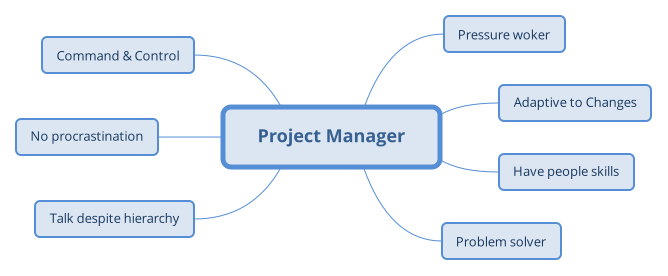
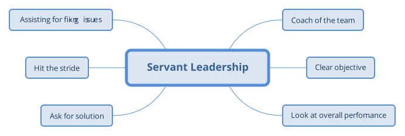
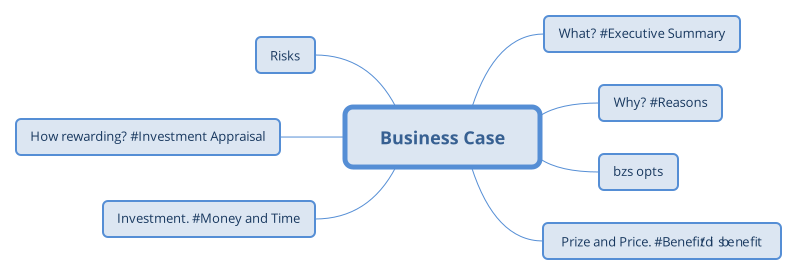

#Project Management

## Project

### What is a project

A temporary endeavor to create a unique product, service, or outcome. It should introduce **changes to org**, have a **start to end**, being **cross-functional**, **unique**, and **not free(anymeans)**.

### Why use a project

1. Strategic alignment of key activities and visibility at appropriate level.

2. Priorities activities.

3. Deliver change in a structured and organized manner.

4. Effective and efficient management of organization's limited resources.

5. Establish ownership and accountability.

6. Provides clarity across what will be done, when, who, why, and the outcome.

## Project Management Overall

### What is project management

Planning, delegating, monitoring, and controlling of all aspects of a project; and motivating **those** involved in the project to achieve objective within limited **time, cost, quality, scope, benefits, and risks**.

> Working on project, manipulating people, to achieve objectives, using limited resources.

Its valuable because:

- Resource is limited

- Risk needs to be managed

- Issues persists

- Changes need to be made

- Knowledge needs to be obtained

- Experience should be obtained

### Project Manager

Key features:

> Strong knowledge worker who knows how to manipulate people, inspire them, and targeted on achieving project objectives.

What project manager do:

> Project manager needs to **Plan** -> **Organize** -> **Lead** -> **Control** the project from start to end.

### Scrum Master

**Command & Control** -> **Servant Leadership**

> Works is distributed to team members who deems fit the job. Scrum master doesn't have to be all power, but know when to give permission.

### Project Managing Process and SDLCs

> PRINCE2 & PMBOK are PMP; Agile and Formal are set of SDLCs.

| PRINCE2 | PMBOK |
| :-: | :-: |
| Gov Backed | Useful standard |
| Widely used & accepted - Consulting, Private, Gov | Plan future in details |
| Process oriented | Substantial & detailed framework |
| Project -> Stages | Rigorous Control |
| Detailed & Thorough | Clearly defined roles |
| Clear need, target customer, realistic benefit, thorough analysis |  Clear and validated deliverables |

> PRINCE2 is overall better (No args accepted). 

PRINCE2 has extensive documentation which is helpful with corporate planning and tracking.

PMBOK has extensive tools, techniques, and supporting template to manage, monitor, and control.

---

| Agile | Formal |
| :-: | :-: |
| Adaptive | Little ALT |
| Constant FB | Req defined at first |
| CI/CD | Sequentially complete task |
| Involvement & Ownership across whole team | PM is the boss |
| Team self select jobs | PM assigned jobs |
| Small actions (Sprint/Scrum/Tasks) | Used in Large SW |
| Customer focus and interactive | Traditional > 40Ys |

> Agile is more flexible, fits CI/CD, increase PRJ success rate of 6%.

Formal methods has extensive planning, accurate timeline & budget. (Better estimation) Difficult on **roll back**

Agile is flexible, better engaged, but difficult without SM, hard to apply on large PRJ.

### How to success

60% chances by looking at: **executive sponsorship** (positive related to PM effort), **emotional maturity** (are people experienced),  **User Involvement** (Agile related), **Optimization** (Requirement states).

Outsource to professionals; using mature architecture; using agile; PM is good; ... (Honestly, the rest is redudant)

## Project Initiation

### Project Screening

Idea to project:

### Business Case

**Case study**(Bz needs) -> **Contraint Study**(Scope, time, cost) -> **Develop Business Case** -> **Project Charter**(Simple display)

> For bosses to know if the project worth taking; how it adds value to the org; matching predefined org characteristics; focus on benefit/investment; document throughout the project.

---

> Non-mandatory (non-volunteering) projects need to make money primarily.

**Return On Investment** : (TD Benefit - TD Cost) / TD Cost \* Total Discounted: a ratio, by AU gov, 4%-10%, avg. 7%.

**Net Present Value** : Net Monetary gain/loss over all future discounted cost and benefit (No idea what it is).

**Payback Period** : How long before benefit > cost, and payback recover initial cost.

**Rough Order of Magnitude** : Estimation increase by time, initially 25% margin plus minus (Cone of Uncertainty).

## Project Planning